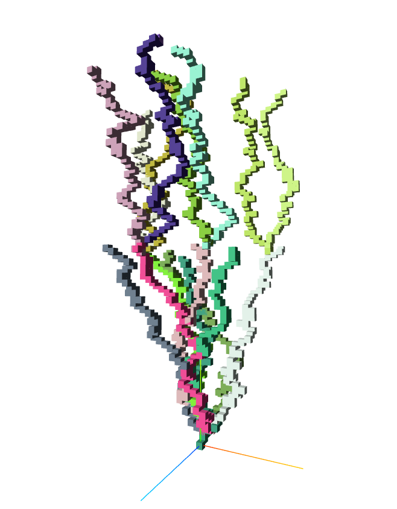

# Version 1

### Description
This version is where I transferred my python code to ThreeJS. So this represents a lot of work that I did in python as well. 

The blocks are placed randomly in the x and z axes. The y position increments continuously for each block. 

Each branch gets a new random color. 

### Parameters
- Total number of blocks
- Number of branches to maintain
- Length of each branch

### Run in your browser
LINK
parameters
const total_num_cubes = 900
    let desired_num_branches = 8
    let desired_branch_length = total_num_cubes/desired_num_branches/2
	
- Total blocks = 900
- Number of branches = 8
- branch length = total blocks / num_branches / 2 = 56

	
### Examples

