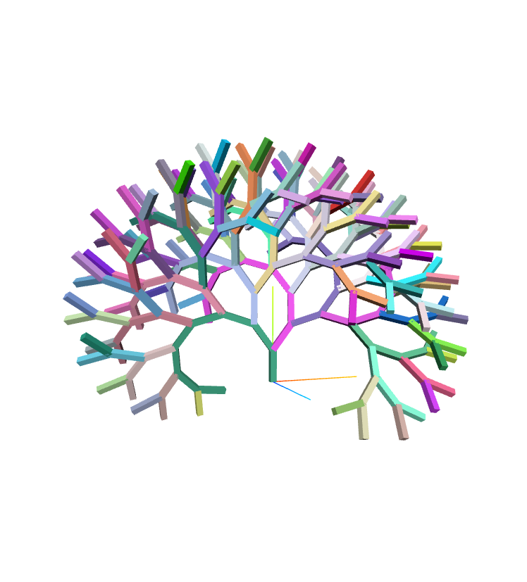
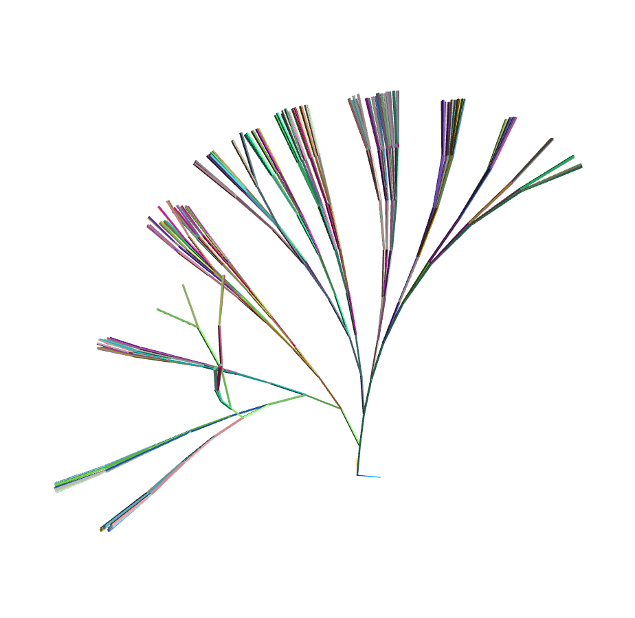
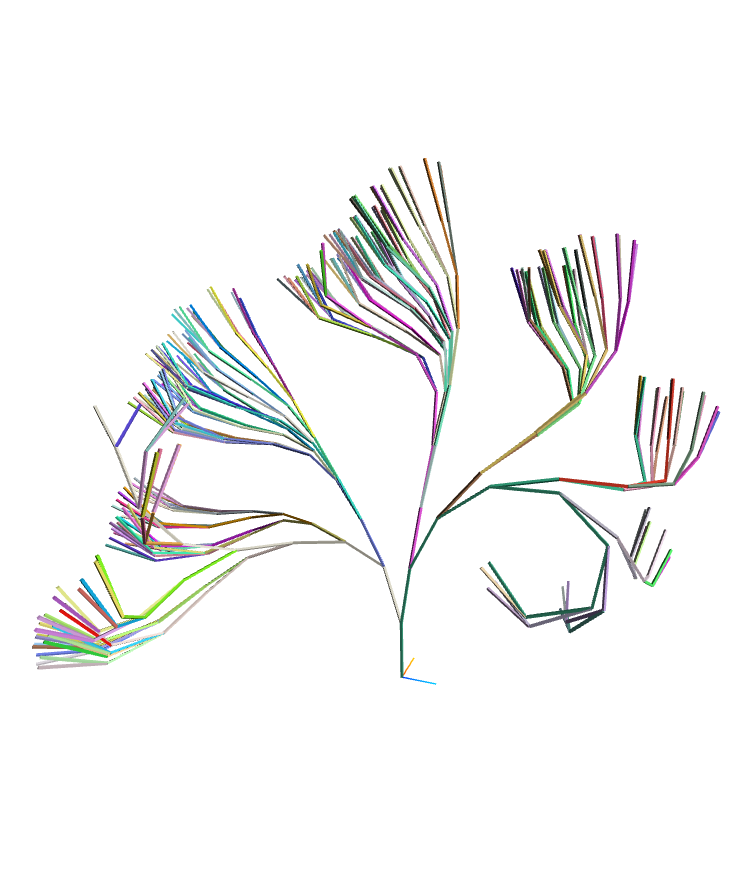
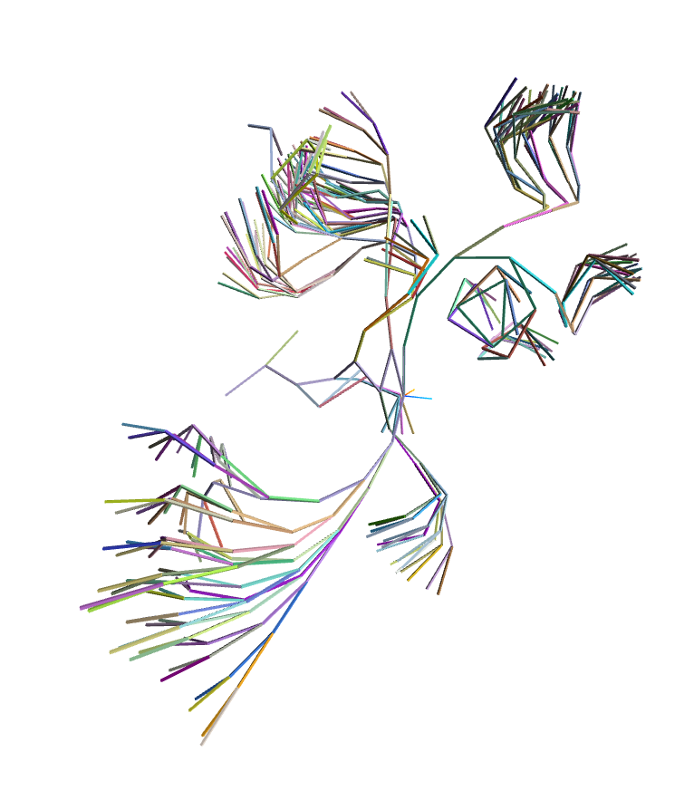

# Step 4: Deterministic placement of pieces

### Description
Instead of randomly placing blocks and branching sometimes, this model will branch every time and rotate pieces by a consistent amount. 

### Features
- Rotation of pieces
- Left and right branch angles can be controlled separately
- Angles can be determined by factors such as branch height in the tree, or horizontal index. This can allow for very interesting complexity.

### Run in your browser
[Link to view in your browser](https://step4deterministic.netlify.app/)

### Interesting Exampes

