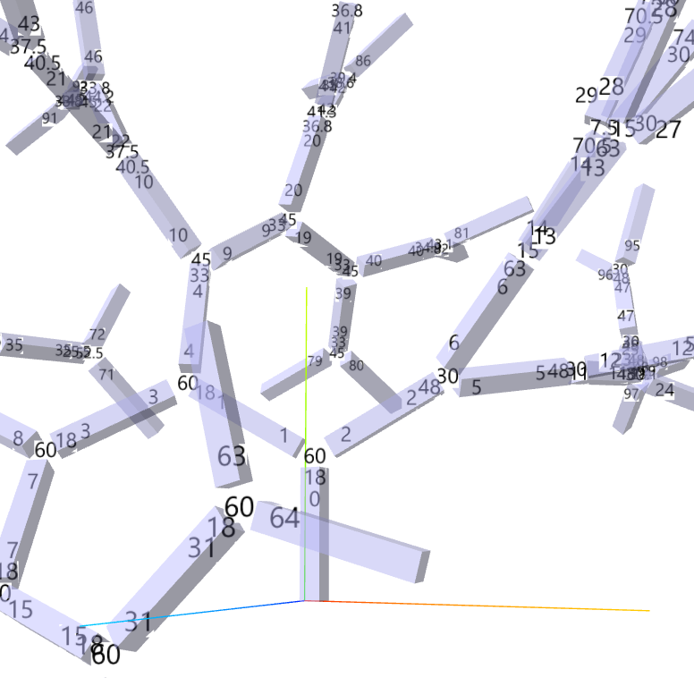
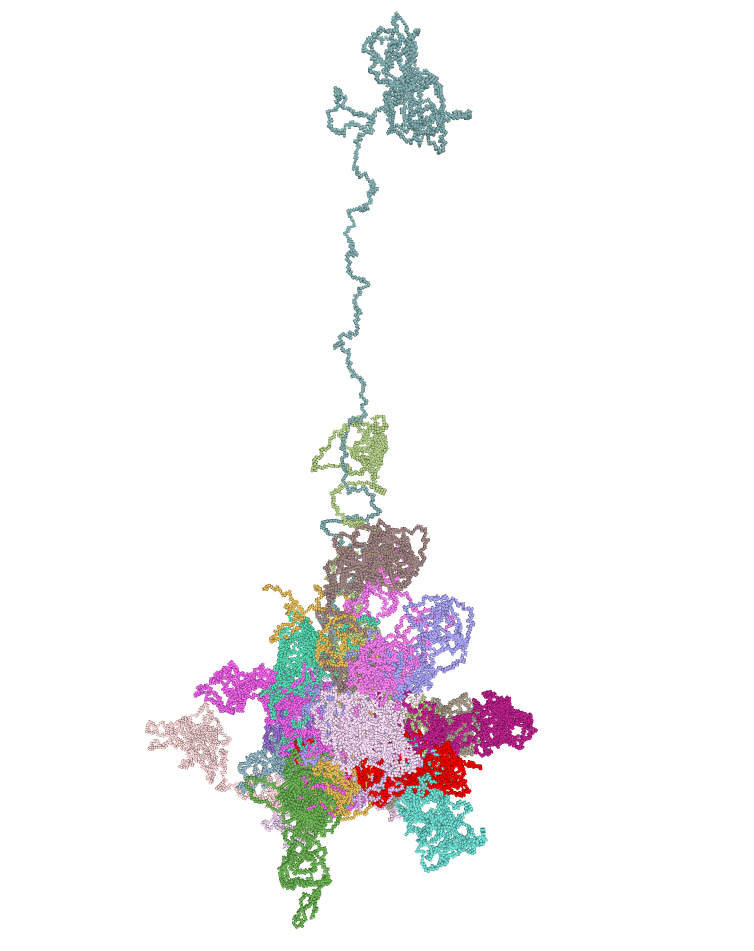

# Version 8

### Description
There are three things that I implemented in this version:
1. I implemented the JS library lil-gui to make sliders for the parameters involved in the rotation of the pieces. 
From the previous version I wrote about the rotation being based on the horizontal location of each piece in the tree within each layer. 
The sliders determined how much is added, multiplied, and exponentiated to that index, which then the result of that is the rotation of that piece in radians. 

2. I made an approximation of the center of gravity of the sculpture by average the center of all the pieces, which works when the pieces are the same size.

3. I made a very simple ruler to judge how large it will be. 

### Run in your browser
Put link here. 

### Examples

