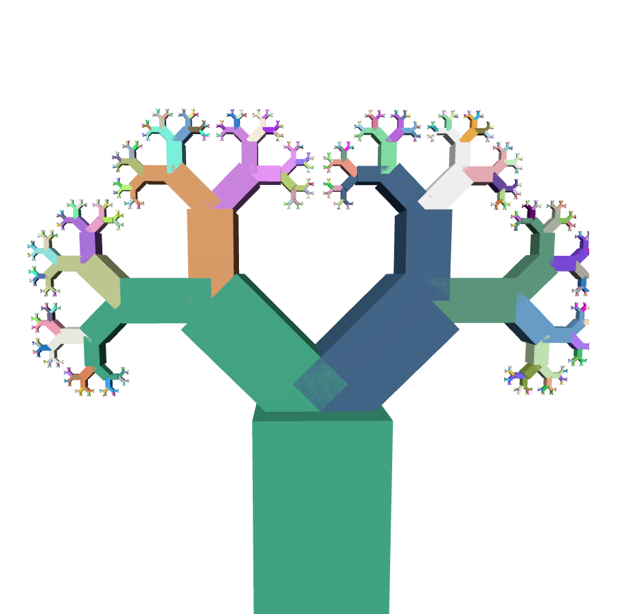

# Step 7: Inter-branch pieces

### Description
Inserted pieces in between each branch. 
These pieces are rotated at a random angle. 

### Run in your browser
[Link to view in your browser](https://step7interbranchpieces.netlify.app/)

### Examples

