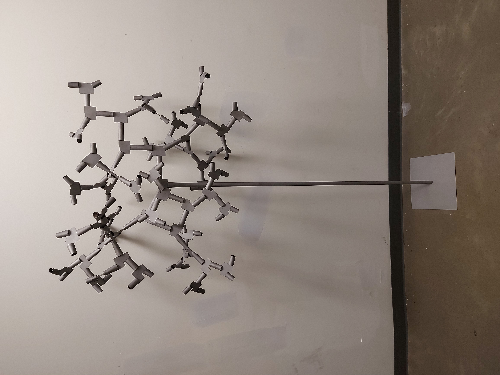
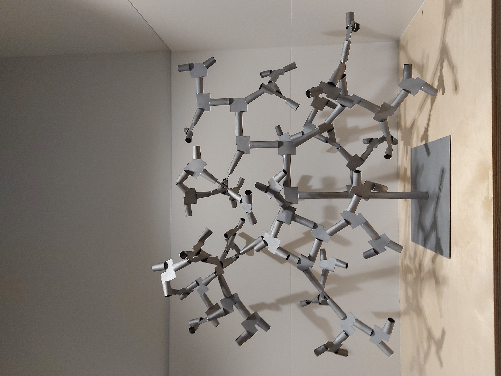
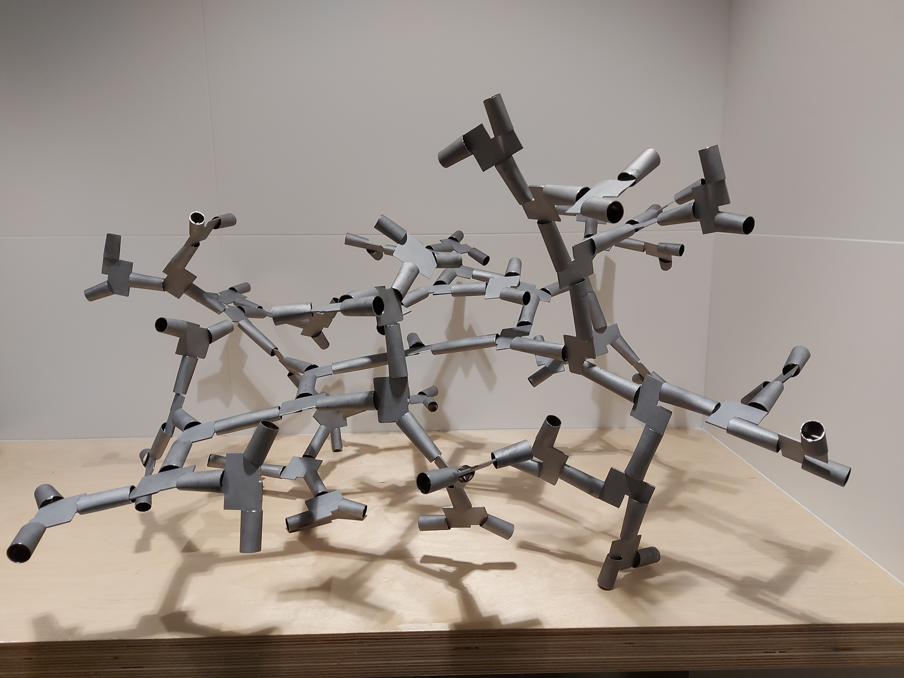

# Step 9 Generating DXF cut file with Python

There are 3 modes that the sculpture can be in base in the length of the trunk. 

1. Long trunk with floor stand:
This was the original idea, but ended up being my least favorite

2. Short trunk for table or plinth

3. No trunk. For a table or plinth. 
This one is my favorite. It's a bit more confusing and inviting. The shadows are really nice as well. 

